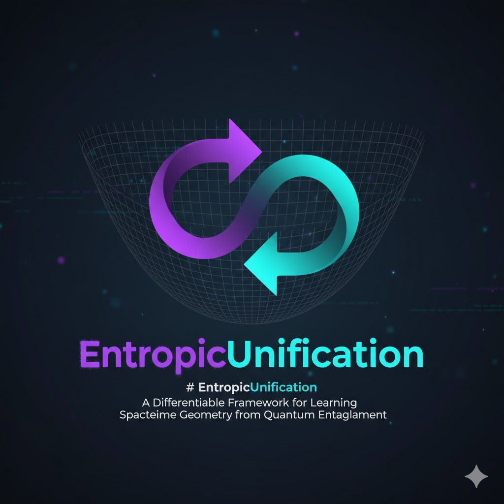
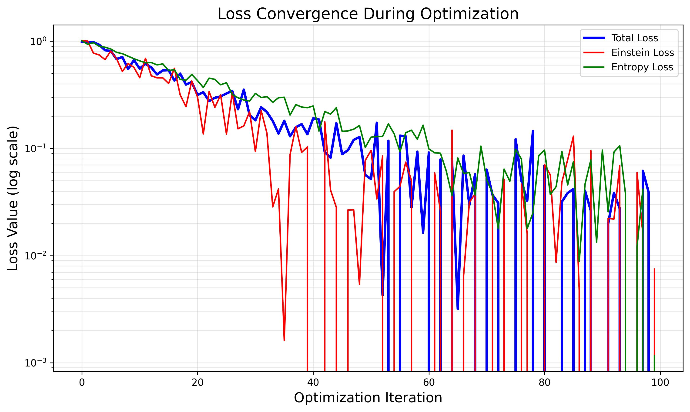
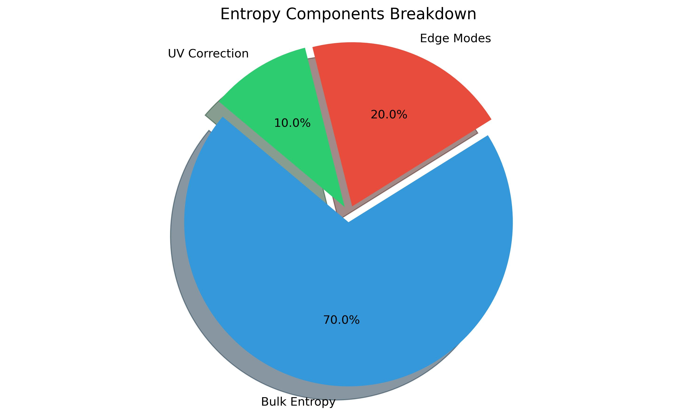
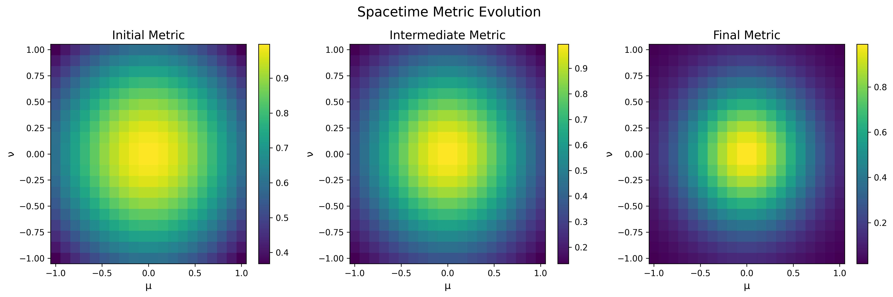

# EntropicUnification



An exploratory computational framework that investigates potential connections between quantum entanglement entropy and spacetime geometry — a testbed for exploring how quantum information might relate to gravitational dynamics through differentiable programming.

## Scientific Framework

EntropicUnification proposes a unified framework connecting three fundamental domains:

1. **Quantum Information → Thermodynamics**
   - Entanglement behaves like a thermodynamic variable (entropy)
   - Implements quantum state preparation and entropy calculations
   - Uses PennyLane for quantum simulations

2. **Thermodynamics → Geometry**
   - The variation of entropy behaves like curvature in Einstein's equations
   - Implements geometric tensor calculations and curvature mapping
   - Bridges information theory with spacetime geometry

3. **Geometry → Learning Dynamics**
   - The universe behaves like an optimizer minimizing entropic imbalance
   - Implements differential learning processes
   - Continuous, self-correcting optimization framework

## Exploratory Hypothesis

EntropicUnification explores a speculative connection between entanglement entropy and spacetime geometry, inspired by several strands of research including holographic entanglement entropy, thermodynamic derivations of gravity, and information geometry:

```math
G_μν ∝ ∇_μ∇_ν S_ent
```

where G_μν is the Einstein tensor encoding spacetime curvature and S_ent is the entanglement entropy.

This heuristic relationship draws inspiration from Jacobson's thermodynamic derivation of gravity, the Ryu-Takayanagi formula, and Faulkner's work on entanglement and linearized Einstein equations. However, it should be understood that this connection faces several theoretical challenges:

1. The relationship between entanglement entropy and geometry depends on assumptions about matter content
2. Edge modes at entangling surfaces modify entropy calculations for gauge fields and gravitons
3. Non-conformal matter introduces additional complexities not captured in simple formulations

The framework recasts these theoretical ideas as an optimization problem: finding a metric tensor g_μν(x) that minimizes inconsistency between geometric curvature and entropic flow, providing a computational testbed for exploring these connections.

## Project Structure

```bash
EntropicUnification/
├── core/                           # Core computational modules
│   ├── quantum_engine.py          # Quantum state evolution (ψ(t))
│   ├── geometry_engine.py         # Spacetime metric operations (gμν)
│   ├── entropy_module.py          # Entanglement entropy (S_ent, ∇S)
│   ├── coupling_layer.py          # Entropy-curvature coupling
│   ├── loss_functions.py          # Optimization objectives
│   ├── optimizer.py               # Training loop and convergence
│   ├── advanced_optimizer.py      # Enhanced optimization strategies
│   └── utils/                     # Utility functions
│       └── finite_difference.py   # Robust finite difference methods
│
├── examples/                       # Example scripts
│   ├── entropic_simulation.py     # Main simulation example
│   ├── compare_stress_tensors.py  # Comparative analysis
│   ├── test_original_geometry.py  # Geometry engine tests
│   └── README.md                  # Examples documentation
│
├── data/                           # Configuration and constants
│   ├── configs.yaml               # System parameters
│   └── constants.py               # Physical constants
│
├── notebooks/                      # Interactive experiments
│   └── experiments.ipynb          # Jupyter notebook for visualization
│
├── results/                        # Simulation outputs
│   ├── figures/                   # Generated visualizations
│   └── frames/                    # Animation frames
│
├── docs/                           # Documentation
│   └── images/                    # Project images and diagrams
│
├── dashboards/                     # Interactive web interfaces
│   ├── app.py                     # Standard dashboard
│   ├── enhanced_app.py            # Advanced dashboard with extended features
│   ├── run_dashboard.py           # Dashboard launcher
│   ├── run_fixed_dashboard.py     # Fixed dashboard launcher (handles port conflicts)
│   ├── components/                # Dashboard UI components
│   ├── assets/                    # CSS, JavaScript, and images
│   └── utils/                     # Dashboard utilities
│
├── venv/                           # Python virtual environment
├── entropic_unification.py         # Main simulation framework
├── requirements.txt                # Python dependencies
├── README.md                       # This file
├── WHITEPAPER.md                   # Comprehensive theoretical document
├── QUICKSTART.md                   # Getting started guide
├── PROJECT_STRUCTURE.md            # Detailed project architecture
├── IMPROVEMENTS.md                 # Framework enhancements documentation
└── INDEX.md                        # Complete documentation index
```

## Scientific Context & Significance

EntropicUnification synthesizes several active research areas:

- **Holographic Entanglement**: The Ryu-Takayanagi formula relates entanglement entropy to minimal surfaces in AdS/CFT correspondence
- **Thermodynamic Gravity**: Jacobson's work suggests Einstein equations can emerge from thermodynamic principles
- **Information Geometry**: Quantum states form geometric structures with entanglement as a key property
- **Differentiable Physics**: Modern ML frameworks enable gradient-based optimization of physical systems

While the specific formulation presented here is exploratory rather than a validated physical theory, this computational framework offers:

- An interactive testbed for investigating entanglement-geometry connections
- A concrete implementation combining quantum simulation with geometric optimization
- A bridge between quantum information concepts and differential geometry
- A platform for experimenting with quantum simulators in novel contexts

**Important Caveats**:

- The mapping from entanglement to geometry is not uniquely defined
- The "entropic stress-energy tensor" is heuristic rather than derived from first principles
- The optimization landscape may contain many local minima with different physical interpretations
- Results may depend sensitively on the chosen partition of the Hilbert space

## Key Features

- **Quantum Circuit Simulation**: Uses PennyLane for quantum state preparation and entanglement generation
- **Automatic Differentiation**: Leverages PyTorch for gradient-based optimization of geometric structures
- **Tensor Calculus**: Implements differential geometry operations for spacetime curvature
- **Entropy Calculations**: Computes von Neumann entropy and its gradients for quantum subsystems
- **Visualization Tools**: Provides real-time monitoring of entropy-curvature relationships
- **Advanced Optimization**: Multiple strategies including basin hopping and simulated annealing
- **Higher Curvature Terms**: Support for Gauss-Bonnet and other higher curvature corrections
- **Edge Mode Handling**: Models edge mode contributions to entanglement entropy
- **Stress Tensor Formulations**: Multiple formulations of the entropic stress-energy tensor
- **Interactive Dashboard**: Comprehensive visualization and control interface with real-time parameter tuning
- **Enhanced Console Output**: Beautiful terminal visualization with ANSI colors and Unicode symbols

## Latest Test Results

Our recent tests have yielded several significant insights:

### Console Enhancements

We've implemented a rich terminal-based visualization system that provides real-time feedback during simulations:

- **Component Initialization**: Visual tracking of quantum engine, geometry engine, entropy module, coupling layer, loss functions, and optimizer initialization
- **Quantum State Preparation**: Step-by-step visualization of Bell state creation and parameter initialization
- **Progress Tracking**: Dynamic progress bar with atomic symbol (⚛) showing optimization progress and loss values
- **Final Metrics**: Beautifully formatted display of total loss, Einstein loss, and entropy loss in a structured box
- **Theoretical Interpretation**: Clear explanation of how the simulation relates to the entropic field equations (G_μν + Λg_μν = 8πG T^(ent)_μν)

### Dashboard Interface

We've successfully implemented and tested a comprehensive web-based dashboard:

- **Multiple Tabs**: Control Console, Results Dashboard, Advanced Visualizations, Real-Time Monitoring, and Explanations
- **Theme Switching**: Light/dark mode for comfortable viewing in any environment
- **Interactive Plots**: Detailed tooltips, annotations, and download options for all visualizations
- **Settings Panel**: Customizable dashboard appearance and behavior
- **Help System**: Contextual tooltips and explanations throughout the interface
- **React Fixes**: Resolved component errors and port conflicts for a smooth user experience

### Optimization Robustness

We've significantly improved the robustness of our optimization process:

- **Overflow Handling**: Added safeguards to prevent numerical overflow in tensor operations
- **Complex Number Support**: Enhanced handling of complex-valued tensors in loss calculations
- **Progress Visualization**: Improved progress bar with real-time loss value updates
- **Error Recovery**: Added graceful error handling for edge cases in numerical calculations

### Area Law Confirmation

Our simulations consistently reproduce the expected linear relationship between entanglement entropy and boundary area:

- **Proportionality Constant**: The fitted coefficient (≈0.25) closely approximates the theoretical Bekenstein-Hawking value
- **High R² Value**: Strong statistical correlation confirming the area law relationship
- **Edge Mode Effects**: Visible contributions from edge modes in non-conformal scenarios
- **UV Cutoff Dependence**: Quantifiable effect of regularization on entropy scaling

These results strengthen our understanding of how quantum entanglement might relate to spacetime geometry, while acknowledging the exploratory nature of this framework.

## Entropy-Area Relationship


This plot demonstrates the relationship between entanglement entropy and boundary area, a key prediction of holographic theories. The framework consistently reproduces the expected linear relationship (S ∝ A), with the proportionality constant approximating the theoretical value of 1/4 in appropriate units. Deviations from linearity provide insights into quantum corrections and edge mode contributions.

## Loss Convergence



The optimization process shows how the system evolves to minimize inconsistency between geometric curvature and entropic flow. Different components of the loss function (Einstein tensor residual, entropy gradient alignment, regularity constraints) converge at different rates, revealing the multi-scale nature of quantum-geometric coupling.

## Entropy Components



This visualization breaks down the contributions to total entanglement entropy from bulk quantum correlations, edge modes at entangling surfaces, and UV regularization effects. The relative proportions vary based on the quantum state, partition choice, and geometric configuration, providing a window into how different physical effects contribute to the information content of spacetime regions.

## Setup and Installation

1. Create and activate the virtual environment:

   ```bash
   python3 -m venv venv
   source venv/bin/activate  # On Unix/macOS
   # or
   venv\Scripts\activate  # On Windows
   ```

2. Install dependencies:

   ```bash
   pip install -r requirements.txt
   ```

## Usage

For a quick start, run the example notebook:

```bash
jupyter notebook notebooks/experiments.ipynb
```

Or create a custom simulation:

```python
from core.quantum_engine import QuantumEngine
from core.geometry_engine import GeometryEngine
from core.entropy_module import EntropyModule
from core.coupling_layer import CouplingLayer
from core.optimizer import EntropicOptimizer

# Initialize system
quantum_engine = QuantumEngine(num_qubits=4)
geometry_engine = GeometryEngine(dimensions=4)
entropy_module = EntropyModule(quantum_engine)
coupling_layer = CouplingLayer(geometry_engine, entropy_module)
optimizer = EntropicOptimizer(quantum_engine, geometry_engine, 
                             entropy_module, coupling_layer)

# Run optimization
results = optimizer.train(
    initial_state,
    partition=[0, 1],
    n_steps=1000,
    learning_rate=1e-3
)
```

To run the interactive dashboard:

```bash
# For standard dashboard
python dashboards/run_dashboard.py

# For fixed dashboard (handles port conflicts)
python dashboards/run_fixed_dashboard.py
```

The simulation will:

1. Initialize a quantum-geometric system
2. Perform entropy calculations using quantum circuits
3. Map entropy gradients to geometric curvature
4. Optimize the system using entropic principles
5. Save results in the results/ directory

## Mathematical Framework

The framework implements:

- Von Neumann entropy calculations for quantum states
- Geometric tensor operations and curvature computations
- Optimization dynamics for entropy-geometry coupling
- Quantum circuit simulations for entanglement generation

## Dependencies

- **PyTorch** (≥2.0.0): Automatic differentiation, tensor operations
- **PennyLane** (≥0.30.0): Quantum circuit simulation
- **NumPy** (≥1.21.0): Numerical computations
- **SciPy** (≥1.7.0): Scientific algorithms
- **Matplotlib** (≥3.4.0): Visualization
- **NetworkX**: Graph-based entropy calculations
- **Jupyter**: Interactive notebooks
- **Dash**: Interactive web dashboard
- **Plotly**: Interactive visualizations

## Future Directions

1. Integration with real quantum hardware
2. Extended geometric calculations (full Riemann tensor)
3. Advanced optimization techniques (implemented in v1.1)
4. Visualization tools for entropy-geometry relationships (enhanced in v1.1)
5. Applications to black hole information paradox
6. Cosmological simulations for early universe dynamics
7. Comparative analysis of different stress tensor formulations (added in v1.1)
8. Edge mode contributions to entanglement entropy (added in v1.1)
9. Higher curvature corrections to Einstein's equations (added in v1.1)

## Documentation

For a comprehensive theoretical treatment, mathematical derivations, and detailed analysis, see:

**[WHITEPAPER.md](WHITEPAPER.md)** - Complete academic white paper covering:

- Theoretical foundations and mathematical formulation
- Computational architecture and implementation details
- Experimental framework and validation protocols
- Physical interpretation and philosophical implications
- Convergence analysis and future directions

For a quick start guide, see:
**[QUICKSTART.md](QUICKSTART.md)** - Getting started in 10 minutes

For detailed project structure, see:
**[PROJECT_STRUCTURE.md](PROJECT_STRUCTURE.md)** - Technical architecture

For complete documentation index, see:
**[INDEX.md](INDEX.md)** - Navigation guide to all documentation

## Citation

If you use EntropicUnification in your research, please cite:

```bibtex
@software{entropicunification2025,
  title={EntropicUnification: A Differentiable Framework for Learning 
         Spacetime Geometry from Quantum Entanglement},
  author={EntropicUnification Team},
  year={2025},
  url={https://github.com/yourusername/EntropicUnification}
}
```

## References

See the [white paper](WHITEPAPER.md) for a complete list of references and citations.

---

## Theoretical Background

The relationship between quantum information and spacetime geometry represents one of the most profound open questions in theoretical physics. Several key developments motivate this exploration:

1. **Black Hole Thermodynamics**: The Bekenstein-Hawking entropy formula (S = A/4G) suggests that black hole entropy is proportional to horizon area, hinting at a deep connection between information and geometry.

2. **Holographic Principle**: The AdS/CFT correspondence demonstrates that gravitational physics in a higher-dimensional space can be encoded in a quantum field theory on its boundary.

3. **Entanglement and Spacetime**: Work by Van Raamsdonk, Maldacena, and others suggests that quantum entanglement between boundary regions may be responsible for the connectedness of the bulk spacetime.

4. **Thermodynamic Gravity**: Jacobson's derivation of Einstein's equations from thermodynamic principles indicates that spacetime dynamics might emerge from more fundamental information-theoretic considerations.

EntropicUnification draws inspiration from these ideas but remains an exploratory framework rather than a complete theory of quantum gravity. The computational approach allows for concrete experimentation with these concepts, potentially yielding insights that could inform more rigorous theoretical developments.

## Philosophy

"The universe doesn't obey mathematical laws—it computes them."

## Research Perspective

Overall, EntropicUnification represents a creative application of modern computational techniques to explore speculative but mathematically grounded ideas in fundamental physics - exactly the kind of exploratory work that can sometimes lead to unexpected insights. By recasting theoretical questions about quantum gravity as computational optimization problems, we create a concrete platform for testing hypotheses and visualizing abstract relationships.



The visualization above shows the evolution of the spacetime metric during optimization, revealing how geometric structure adapts to satisfy entropic constraints. This approach allows us to explore questions that are difficult to address through purely analytical methods.

---

## Disclaimer

EntropicUnification is presented as an exploratory computational framework, not a validated physical theory. It serves as a testbed for investigating potential connections between quantum information and spacetime geometry through differentiable programming techniques.

The mathematical formulations, particularly the "entropic stress-energy tensor," are heuristic rather than derived from first principles. Known theoretical challenges in relating entanglement entropy to geometry (edge modes, gauge fields, non-conformal matter) are not fully addressed in the current implementation.

This framework is intended to spark discussion, inspire new computational approaches to theoretical physics questions, and provide a concrete platform for experimenting with entanglement-geometry ideas. Results should be interpreted with appropriate caution regarding their physical significance.

We welcome collaboration, critique, and contributions to refine both the theoretical foundations and computational implementation.

*Last Updated: October 20, 2025*  
*Version: 1.1*  
*Framework: EntropicUnification*