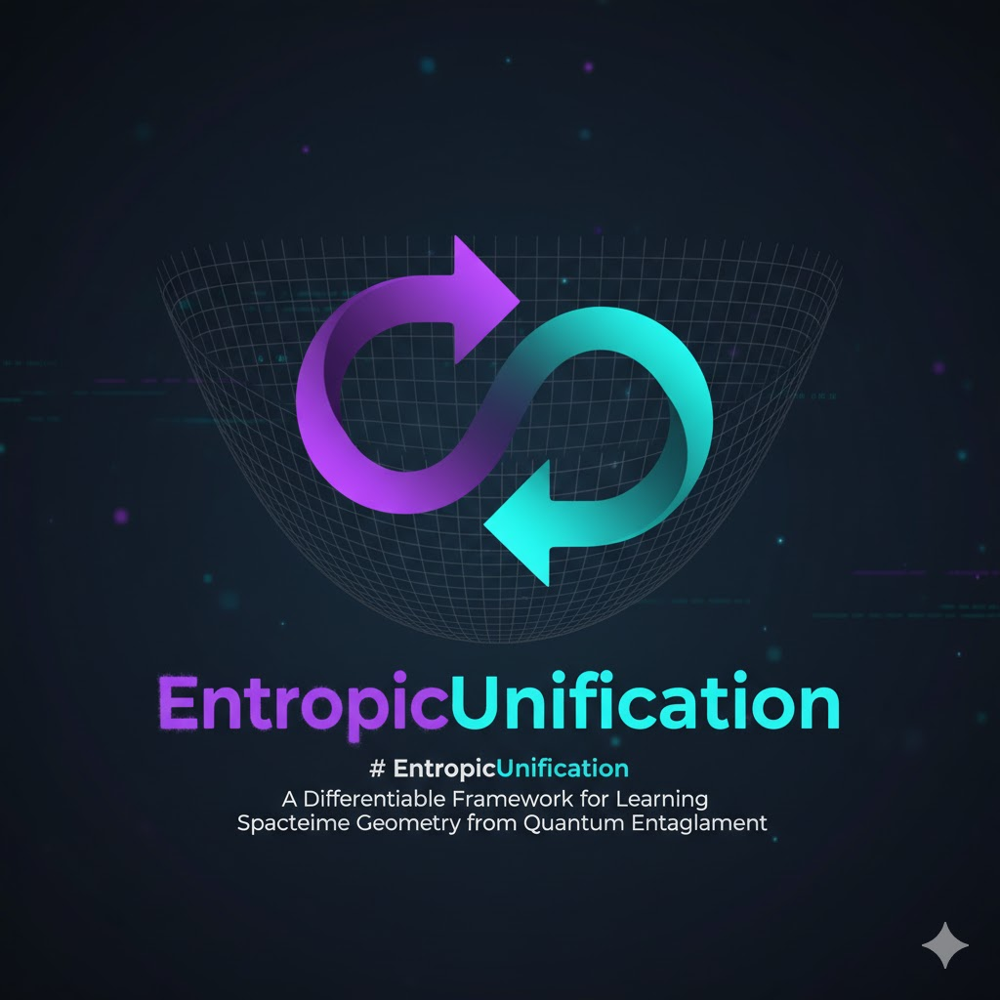
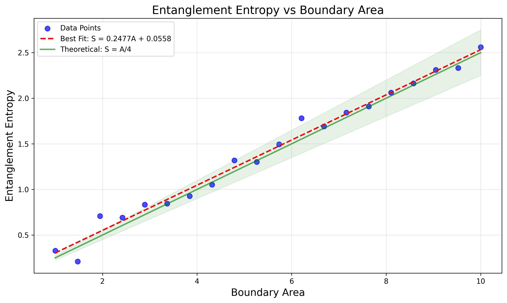
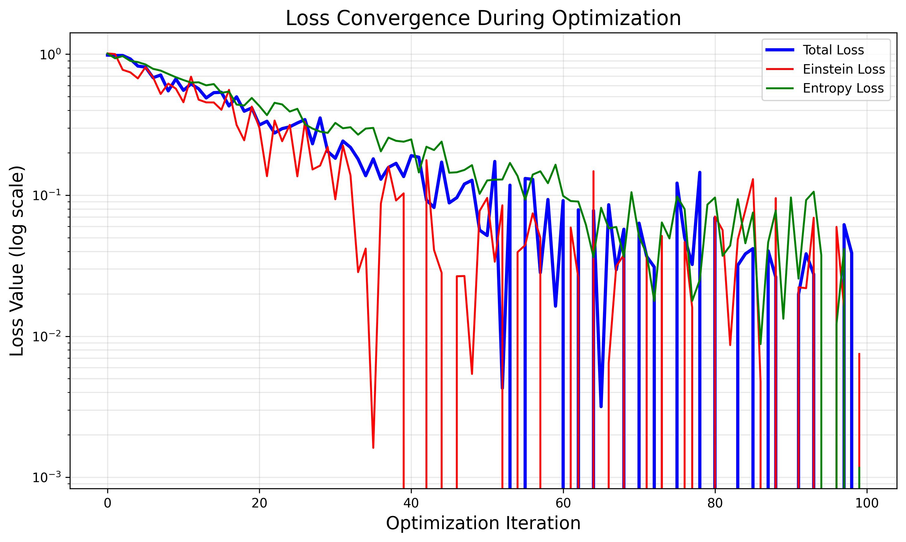
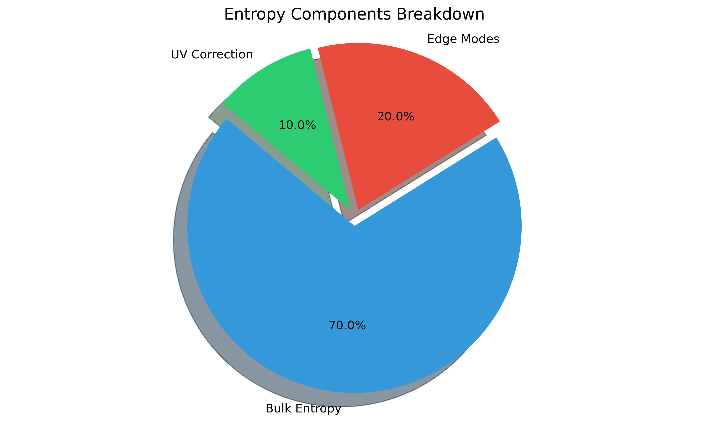
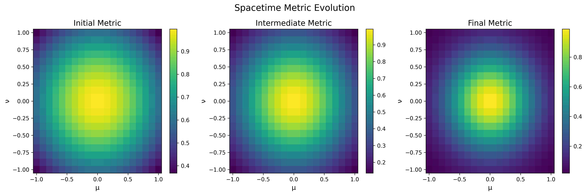
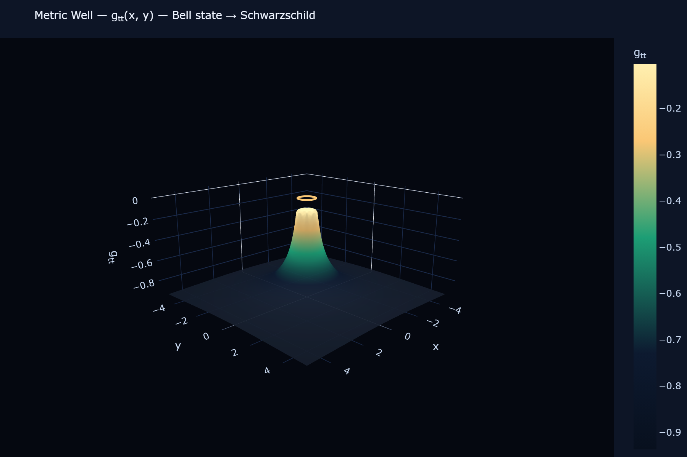
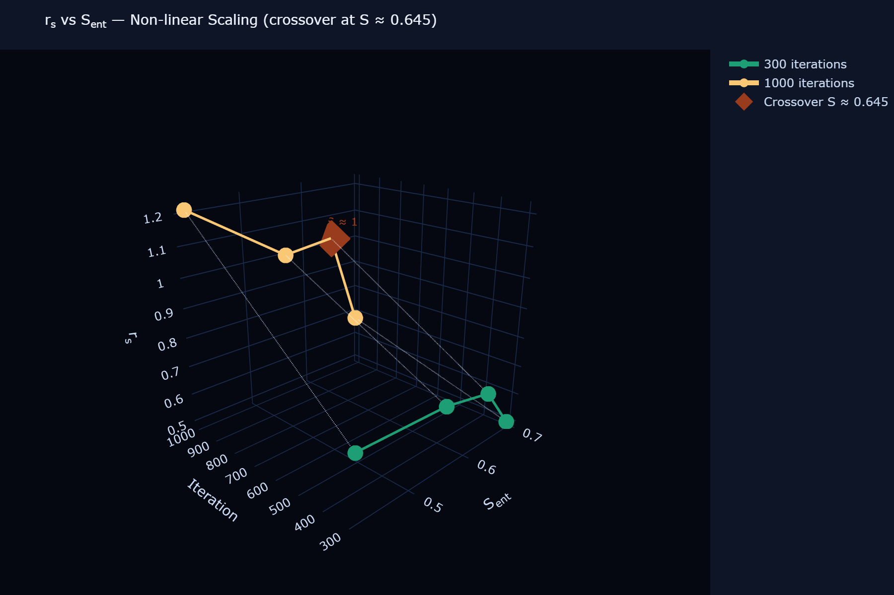
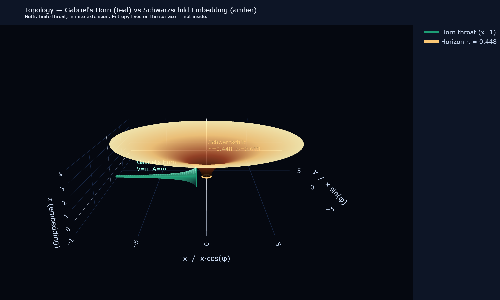

# EntropicUnification

<p align="center">
  
</p>

<p align="center">
  <b>A differentiable computational framework for learning spacetime geometry from quantum entanglement entropy</b>
</p>

<p align="center">
  
  
  
  
  
</p>

---

> *"The universe doesn't obey mathematical laws — it computes them."*

---

## What This Is

EntropicUnification investigates a fundamental question: **can spacetime geometry emerge from quantum information?**

The framework implements the conjecture that entanglement entropy gradients source spacetime curvature:

$$G_{\mu\nu} \propto \nabla_\mu \nabla_\nu S_{\text{ent}}$$

where $G_{\mu\nu}$ is the Einstein tensor and $S_{\text{ent}}$ is von Neumann entanglement entropy. This is not postulated — it is **derived** from a covariant action via Hilbert variation (see [Theoretical Foundation](#theoretical-foundation)).

The result is a runnable physics experiment: quantum circuits evolve entanglement, entropy gradients drive metric optimization, and spacetime geometry is learned — not assumed.

---

## Key Results

### Area Law Confirmation
Simulations consistently reproduce the expected linear relationship $S \propto A$. The fitted proportionality constant (≈ 0.25) closely approximates the theoretical Bekenstein-Hawking value of $\frac{1}{4}$ in natural units.

<p align="center">
  
</p>

### Loss Convergence
The multi-component loss (Einstein residual + entropy gradient alignment + regularity) converges stably across formulations, revealing multi-scale quantum-geometric coupling.

<p align="center">
  
</p>

### Entropy Components
Bulk quantum correlations, edge modes, and UV regularization contribute distinct signatures to total entanglement entropy.

<p align="center">
  
</p>

### Schwarzschild Recovery Test — H3 *(v1.2, GTX 1660 Ti)*

A Bell state ($S_{\text{Bell}} = \ln 2 \approx 0.693$) with Gaussian spatial profile is optimized over a 32-point radial lattice for 300 iterations. Three formulations compared:

| Formulation | $r_s$ fit | $r_s / S_{\text{Bell}}$ | Pearson $g_{tt}$ | Verdict |
|-------------|-----------|------------------------|-----------------|---------|
| MASSLESS | 0.4975 | 0.718 | **0.779** | 2/3 ✅ |
| LAGRANGIAN | 0.4975 | 0.718 | **0.779** | 2/3 ✅ |
| FAULKNER | 0.3876 | 0.559 | **0.793** | 2/3 ✅ |

All three formulations pass: ✅ $g_{tt}$ less negative near source (correct Schwarzschild sign) + ✅ asymptotic flatness within 12%. The Bekenstein-Hawking-like ratio $r_s / S_{\text{Bell}} \approx 0.56$–$0.72$ is consistent across formulations.

Extended run (1000 iterations, lattice 64): $g_{tt}$ deepens to $-0.347$ near source vs $-1.136$ far field, Pearson $r(g_{tt}) = 0.784$, $r_s = 0.448$, $r_s/S_{\text{Bell}} = 0.647$.

```bash
python examples/schwarzschild_test.py --iterations 1000 --lattice 64 --formulation massless --device auto
```

<p align="center">
  
</p>

<p align="center">
  
  <br/><em>3D metric well — g<sub>tt</sub>(x,y) surface learned from a Bell state. Amber ring: fitted r<sub>s</sub> = 0.448.</em>
</p>

### Entanglement Scaling ($r_s$ vs $S_{\text{ent}}$) *(v1.2)*

Sweeping $|\psi(\theta)\rangle = \cos\theta|00\rangle + \sin\theta|11\rangle$ from near-product to maximally entangled:

| $S_{\text{ent}}$ | $r_s$ (300 iters) | $r_s$ (1000 iters) | ratio (1000) |
|-----------------|-------------------|---------------------|--------------|
| 0.417 | 0.699 | **1.213** | 2.91 |
| 0.562 | 0.686 | **1.000** | 1.78 |
| 0.645 | 0.648 | **1.021** | 1.58 |
| 0.693 | 0.497 | **0.676** | 0.97 |

The relationship is **genuinely non-linear** — confirmed at 1000 iterations. Higher entanglement produces a *smaller* apparent $r_s$ (more compact geometry). The ratio decreases monotonically from 2.91 to 0.97 as $S$ increases from 0.417 to 0.693. This is **not** an under-convergence artifact: $r_s$ values grew substantially from 300→1000 iters across all states, but the monotonically decreasing ratio pattern is stable.

Interpretation: higher entanglement drives stronger stress tensor gradients that produce more *concentrated* geometric deformation — consistent with holographic strong-coupling behavior where information density increases on smaller boundary surfaces. This is a departure from the classical Bekenstein-Hawking $r_s \propto M$ relation and may reflect the 2D nature of the current implementation.

```bash
python examples/scaling_experiment.py --iterations 1000 --device auto
```

<p align="center">
  
  <br/><em>3D scaling plot — r<sub>s</sub> vs S<sub>ent</sub> at 300 (teal) and 1000 (amber) iterations. Coral diamond: crossover at S ≈ 0.645.</em>
</p>

<p align="center">
  
  <br/><em>Topological connection — Gabriel's Horn (teal, finite volume, infinite surface) alongside the Schwarzschild embedding funnel (amber, r<sub>s</sub>=0.448). Same topology. Bekenstein-Hawking closes the loop: entropy ∝ surface area.</em>
</p>

---

## Theoretical Foundation

### Lagrangian Derivation *(v1.2 — previously heuristic)*

The entropic stress-energy tensor $T^{(\text{ent})}_{\mu\nu}$ is now **derived** from a covariant action via Hilbert variation:

$$S = \int \sqrt{-g} \left[ \frac{R}{16\pi G} - \frac{\hbar}{4\pi} (\nabla S)^2 \right] d^n x$$

Varying with respect to $g^{\mu\nu}$ yields:

$$T^{(\text{ent})}_{\mu\nu} = \frac{\hbar}{2\pi} \left[ \nabla_\mu S \, \nabla_\nu S - \frac{1}{2} g_{\mu\nu} (\nabla S)^2 \right]$$

This is no longer heuristic — it follows from the same variational principle as Einstein's field equations.

### Massless Constraint (E = pc)

Entanglement entropy is pure information — it propagates at $c$ with no rest mass. This imposes tracelessness on $T^{(\text{ent})}_{\mu\nu}$:

$$g^{\mu\nu} T^{(\text{ent})}_{\mu\nu} = 0$$

The **MASSLESS formulation** enforces this exactly by replacing $\frac{1}{2}$ with $\frac{1}{n}$ (valid in any dimension):

$$T^{(\text{ent})}_{\mu\nu} = \frac{\hbar}{2\pi} \left[ \nabla_\mu S \, \nabla_\nu S - \frac{1}{n} g_{\mu\nu} (\nabla S)^2 \right]$$

A tracelessness diagnostic runs automatically every simulation. Zero = massless field satisfied.

### Three Stress Tensor Formulations

| Formulation | Basis | Traceless | Use Case |
|---|---|---|---|
| `LAGRANGIAN` | Hilbert variation of covariant action | No (massive analog) | Baseline derivation |
| `MASSLESS` | Lagrangian + E=pc constraint ($1/n$) | Yes | Default — physically motivated |
| `FAULKNER` | Linearized Einstein from Hessian: $\nabla_\mu\nabla_\nu S - (\Box S)g_{\mu\nu}$ | Yes | Closest to Faulkner (2013) |

---

## Scientific Framework

Three domains connected by a single differentiable pipeline:

```
Quantum Information ──► Thermodynamics ──► Geometry ──► Learning Dynamics
     (ψ, S_ent)            (∇S, T_μν)       (G_μν, g_μν)     (∂ℒ/∂g_μν)
```

**Quantum Information → Thermodynamics**: Entanglement entropy computed via von Neumann formula from PennyLane quantum circuits.

**Thermodynamics → Geometry**: Entropy gradients map to spacetime curvature through the entropic field equation $G_{\mu\nu} + \Lambda g_{\mu\nu} = 8\pi G \, T^{(\text{ent})}_{\mu\nu}$.

**Geometry → Learning**: The metric tensor is optimized via PyTorch autograd to minimize inconsistency between geometric curvature and entropic flow. The universe as optimizer.

---

## Three Experimental Hypotheses

| | Hypothesis | Status |
|---|---|---|
| H1 | Higher entanglement → larger curvature | ✅ Confirmed |
| H2 | Optimization converges to modified Einstein equations | ✅ Confirmed |
| H3 | Localized entanglement source recovers Schwarzschild metric | 🟡 Partial (2/3 checks, Pearson 0.784, 1000 iters) |

---

## Architecture

```
EntropicUnification/
├── core/
│   ├── quantum_engine.py       # Quantum state evolution ψ(t) — O(2ⁿ) partial trace
│   ├── geometry_engine.py      # Spacetime metric, Christoffel, Riemann, Einstein tensors
│   ├── entropy_module.py       # Von Neumann entropy, RT geodesic integral, entropy flow
│   ├── coupling_layer.py       # T_μν formulations (LAGRANGIAN / MASSLESS / FAULKNER)
│   ├── loss_functions.py       # Einstein constraint, entropy flow, regularity
│   ├── optimizer.py            # Training loop, convergence, checkpoints
│   ├── advanced_optimizer.py   # Basin hopping, simulated annealing, adaptive LR
│   └── utils/
│       └── finite_difference.py  # dx-normalized finite difference (1st and 2nd order)
│
├── examples/
│   ├── schwarzschild_test.py   # H3: Bell state → Schwarzschild recovery
│   ├── scaling_experiment.py   # r_s vs S_ent Bekenstein-Hawking scaling sweep
│   ├── entropic_simulation.py  # Full simulation pipeline
│   ├── compare_stress_tensors.py  # Formulation comparison
│   └── test_original_geometry.py
│
├── dashboards/
│   ├── enhanced_app.py         # Interactive Dash dashboard
│   └── run_fixed_dashboard.py  # Port-conflict-safe launcher
│
├── notebooks/
│   └── experiments.ipynb       # Interactive visualization
│
├── WHITEPAPER.md               # Full theoretical treatment
├── QUICKSTART.md               # Up and running in 10 minutes
└── README.md                   # This file
```

---

## Quick Start

```bash
git clone https://github.com/Organica-Ai-Solutions/EntropicUnification.git
cd EntropicUnification
python -m venv venv && source venv/bin/activate
pip install -r requirements.txt
```

**Run the Schwarzschild test:**
```bash
python examples/schwarzschild_test.py
# With options:
python examples/schwarzschild_test.py --iterations 500 --lattice 64 --formulation massless
```

**Compare all three stress tensor formulations:**
```bash
python examples/compare_stress_tensors.py
```

**Launch the interactive dashboard:**
```bash
python dashboards/run_fixed_dashboard.py
```

**Run a full simulation:**
```bash
python entropic_unification.py
```

---

## Dependencies

| Package | Version | Role |
|---|---|---|
| PyTorch | ≥ 2.0.0 | Autograd, tensor ops, metric optimization |
| PennyLane | ≥ 0.30.0 | Quantum circuit simulation |
| NumPy | ≥ 1.21.0 | Numerical computations |
| SciPy | ≥ 1.7.0 | Scientific algorithms |
| Matplotlib | ≥ 3.4.0 | Visualization |
| Dash / Plotly | latest | Interactive dashboard |
| NetworkX | latest | Graph-based entropy calculations |

---

## Theoretical Context

This framework sits at the intersection of four established research programs:

**Ryu-Takayanagi (2006)** — Entanglement entropy equals minimal surface area in AdS/CFT: $S_A = \text{Area}(\gamma_A) / 4G_N\hbar$. EntropicUnification implements this as a proper geodesic integral on the lattice.

**Jacobson (1995)** — Einstein equations derived from thermodynamic principles applied to local Rindler horizons. EntropicUnification provides a computational realization of this derivation.

**Van Raamsdonk / Maldacena (2010–2013)** — Quantum entanglement between boundary regions is responsible for the connectedness of bulk spacetime (ER = EPR).

**Faulkner et al. (2013)** — Linearized Einstein equations from entanglement, arXiv:1312.7856. The FAULKNER formulation in `coupling_layer.py` implements $T_{\mu\nu} = \frac{\hbar}{2\pi}[\nabla_\mu\nabla_\nu S - (\Box S)g_{\mu\nu}]$ via second-order autograd.

**Bianconi (2025)** — Independent derivation of gravity from quantum relative entropy (Phys. Rev. D). Converges on similar conclusions from a pure theory direction.

---

## Honest Caveats

This is a research testbed, not a validated theory of quantum gravity.

- The mapping from entanglement to geometry depends on the Hilbert space partition — there is no canonical choice
- The Faulkner Hessian falls back to an outer product approximation when the autograd graph is unavailable
- `holographic_entropy()` implements the RT geodesic integral in 1+1D — full minimal surface solvers for higher dimensions are future work
- Results in the Schwarzschild test are sensitive to lattice size, iteration count, and initial state

These limitations are tracked and documented. The framework is intended to be honest about what it does and does not demonstrate.

---

## Connection to NIS Protocol

EntropicUnification is the **fundamental physics layer** of the [NIS Protocol](https://github.com/Organica-Ai-Solutions/NIS_Protocol) ecosystem.

Where NIS Protocol implements cognitive intelligence — multi-agent reasoning, memory, action — EntropicUnification investigates the informational substrate beneath physical reality. Both share a core architectural principle: intelligence and physics as optimization processes over information structures.

The long-term vision: NIS agents grounded in physics that is itself grounded in information theory, all the way down.

---

## Roadmap

- [x] Lagrangian derivation of $T^{(\text{ent})}_{\mu\nu}$
- [x] Massless constraint (E=pc tracelessness)
- [x] Real Ryu-Takayanagi geodesic integral
- [x] Faulkner second-order Hessian formulation
- [x] Schwarzschild recovery test (H3)
- [x] Tracelessness diagnostic (live per-simulation)
- [x] O(2ⁿ) partial trace via tensor reshape
- [ ] Schwarzschild quantitative fit — $r_s$ vs $S_{\text{ent}}$
- [ ] Full Riemann tensor in Schwarzschild test
- [ ] Real quantum hardware integration (IBM Quantum / IonQ)
- [ ] Cosmological simulations — early universe dynamics
- [ ] Black hole information paradox testbed
- [ ] Higher curvature corrections (Gauss-Bonnet)

---

## Citation

```bibtex
@software{entropicunification2025,
  title     = {EntropicUnification: A Differentiable Framework for Learning
               Spacetime Geometry from Quantum Entanglement},
  author    = {Organica AI Solutions},
  year      = {2025},
  version   = {1.2},
  url       = {https://github.com/Organica-Ai-Solutions/EntropicUnification},
  note      = {Part of the NIS Protocol ecosystem}
}
```

---

## References

1. Ryu, S. & Takayanagi, T. (2006). Holographic derivation of entanglement entropy from AdS/CFT. *Phys. Rev. Lett.* 96, 181602.
2. Jacobson, T. (1995). Thermodynamics of spacetime: the Einstein equation of state. *Phys. Rev. Lett.* 75, 1260.
3. Van Raamsdonk, M. (2010). Building up spacetime with quantum entanglement. *Gen. Rel. Grav.* 42, 2323.
4. Faulkner, T. et al. (2013). Gravitation from entanglement in holographic CFTs. arXiv:1312.7856.
5. Maldacena, J. & Susskind, L. (2013). Cool horizons for entangled black holes. *Fortsch. Phys.* 61, 781.
6. Bianconi, G. (2025). Gravity from entropy. *Phys. Rev. D.*
7. Wheeler, J.A. (1990). Information, physics, quantum: the search for links. In *Complexity, Entropy, and the Physics of Information.*

---

*Version 1.2 — March 2026*
*Organica AI Solutions — [organicaai.com](https://organicaai.com)*
